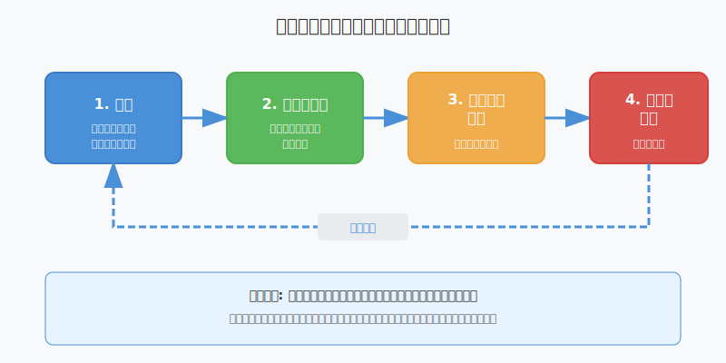

<!-- _class: title -->
<!-- _paginate: false -->

# GitHub Copilot Chat & エージェントモード

---

# このセクションで学ぶこと

- Copilot Chatの概要と効果的なユースケース
- スラッシュコマンドとチャットエージェントの使い方
- Chatのパフォーマンス向上テクニック
- エージェントモードの概要と自律開発支援機能
- MCPとエージェントモードの連携
- GitHub.comでのCopilot Chat活用
- カスタムモデルとエージェント設定（Enterprise）

---

<!-- _class: lecture -->
<!-- _paginate: false -->

# IDEへのGitHub Copilotインストールと設定

---

# VS Codeへのインストール手順

1. VS Codeを開く
2. 拡張機能ビュー（`Ctrl+Shift+X` / `Cmd+Shift+X`）を開く
3. 「GitHub Copilot」を検索
4. **インストール** をクリック
5. 初回はGitHubアカウントへのサインインが必要

---

<!-- _class: lecture -->
<!-- _paginate: false -->

# Copilot Chatの概要と効果的なユースケース

---

# GitHub Copilotの基本：ゴーストテキスト

GitHub Copilot が有効になっていると、提案が「ゴーストテキスト」として表示される

| 操作 | 説明 |
|------|------|
| **Tab キー** | ゴーストテキストを受け入れる |
| 無視 | 何もせずに入力を続けると提案は消える |
| コンテキスト | 開いているファイルを既定でコンテキストとして使用 |

<span class="red">試験ポイント: ゴーストテキストはTabキーで受け入れる</span>

---

# インラインチャットの使用

コードを離れることなく GitHub Copilot と対話できる機能

| OS | ショートカット |
|----|---------------|
| Windows | **Ctrl + I** |
| Mac | **Command + I** |

## 利点
- コンテキストを切り替える必要がない
- 提案と対話はコードの近くで行われる
- 作業の流れを中断せずにAIと対話可能

<span class="red">試験ポイント: インラインチャットはCtrl+I（Win）/ Command+I（Mac）</span>

---

# Copilot Chatの効果的なユースケース

| ユースケース | 説明 | 活用例 |
|-------------|------|--------|
| **コード生成** | アルゴリズム・設計パターンの実装 | 正規表現、SQLクエリ、データ構造 |
| **デバッグ支援** | エラー分析と修正提案 | 論理エラーの特定、修正提案 |
| **コード説明** | 複雑なコードの理解支援 | async/await、未知のコード解説 |

---

# デバッグ支援の活用方法

## 使用手順
1. エラーを含むコードの部分を選択（ハイライト）
2. 右クリックして「Copilot」を選択
3. インラインチャットで質問

## Copilotが支援できること
- 論理エラーの特定
- コードの問題のあるセクションの詳細な説明
- 潜在的な修正の提案

---

<!-- _class: lecture -->
<!-- _paginate: false -->

# スラッシュコマンド一覧と使い方

---

# スラッシュコマンド一覧

チャットウィンドウまたはインラインチャットで使用可能

| コマンド | 用途 |
|---------|------|
| `/tests` | テストの記述に役立つ |
| `/docs` | ドキュメントの記述を目的としている |
| `/fix` | 指定したコードまたは選択したコードの問題を修正 |
| `/doc` | 指定したコードまたは選択したコードにコメントを追加 |
| `/explain` | コードに関する説明を取得 |
| `/generate` | 指定された質問に回答するコードを生成 |
| `/help` | Copilot チャットの使用方法に関するヘルプを取得 |
| `/optimize` | 選択したコードのランタイムを分析して改善 |

---

# チャットエージェント

特定のコンテキストを使用して質問できる機能

| エージェント | 説明 | 使用例 |
|------------|------|--------|
| `@terminal` | ターミナルと対話 | ターミナルコマンドに関する質問 |
| `@workspace` | ワークスペース全体を認識 | プロジェクト全体に関する質問 |
| `@vscode` | VS Code に関連する質問 | IDE 設定の変更方法 |
| `@file` | 特定のファイルに焦点 | 特定ファイルのリファクタリング |
| `@directory` | 特定のディレクトリを考慮 | ディレクトリ内のスクリプト最適化 |

<span class="red">エージェントは質問の前に付ける（例: @workspace XX機能について）</span>

---

# @workspace エージェントの詳細

## 特徴
- プロジェクト全体の情報を使用して適切なコードを生成
- コードベース全体に関する回答を取得可能

## @workspace /new スマートアクション

新しいプロジェクトをゼロから生成

```
@workspace /new は高度な計算のために新しい html ファイル ページと
JavaScript を生成します
```

---

<!-- _class: lecture -->
<!-- _paginate: false -->

# Chatを使ったコード説明・生成

---

# 暗黙的なプロンプト

事前に作成されたプロンプトを暗黙的に提供する機能

## 例: バグのあるPythonコードの修正

```python
with open("file.txt", "r") as file:
    contents = file.read  # バグ: かっこがない
```

## 修正手順
1. コードを選択
2. インラインチャットを開く（Ctrl+I / Command+I）
3. `/fix` コマンドを入力
4. Copilotがコードの修正を提案

---

# 選択的コンテキスト

作業中のコンテキストに基づいて提案をカスタマイズ

## Dockerfileの作成例

```
@workspace help me create a Dockerfile to package this project
but make sure you are using a Virtual Environment for Python.
```

## 注意点
- `@workspace` で具体的に指定することも可能
- 開いているファイルを追加のコンテキストとして使用
- 提案が一致しない場合は、より具体的に指示する

---

<!-- _class: lecture -->
<!-- _paginate: false -->

# Copilot Chatのパフォーマンス向上テクニック

---

# スコープの参照

応答の精度と関連性を高めるための機能

## ファイル参照（#file:）

特定のファイルを指定して質問

```
#file:controller.js このファイルのエラーハンドリングを
改善するにはどうすればよいですか？
```

## 環境参照（@workspace）

ソリューション全体またはワークスペースを参照

```
@workspace 計算関数はどこにありますか
```

---

# コンテキスト設定のベストプラクティス

| テクニック | 効果 | 使用場面 |
|-----------|------|---------|
| `#file:` でファイル指定 | 特定ファイルに焦点を当てた回答 | 特定ファイルの改善・デバッグ |
| `@workspace` でプロジェクト参照 | プロジェクト構造を考慮した回答 | アーキテクチャに関する質問 |
| コードを選択してから質問 | 選択したコードに特化した回答 | コードの説明・修正 |
| 複数ファイルを開いておく | 関連ファイルのコンテキストを利用 | 関連コンポーネント間の整合性確保 |

---

# 効果的なプロンプトの構造

## 悪い例
```
このコードを修正して
```

## 良い例
```
#file:userService.js のgetUser関数で発生しているnull参照エラーを
修正してください。エラーが発生した場合は適切なエラーメッセージを
返すようにしてください。
```

## ポイント
1. **コンテキストを指定**: `#file:` や `@workspace` を使用
2. **具体的な要求**: 何をしたいか明確に記述
3. **制約条件**: 必要に応じて制約を追加

---

<!-- _class: lecture -->
<!-- _paginate: false -->

# Copilot Chatの制限事項とベストプラクティス

---

# モデルの選択とPRU倍率

## 有料プランでのモデル倍率
最新情報は公式ページを確認しましょう。

| モデル | 倍率 | 特徴 |
|--------|:----:|------|
| GPT-5 mini / GPT-4.1 / GPT-4o | **×0** | 基本モデル（消費なし） |
| Gemini 3 Flash / Claude Haiku 4.5 | ×0.33 | 軽量モデル |
| Claude Sonnet 4/4.5 / GPT-5 / Gemini 2.5 Pro | **×1** | 標準プレミアム |
| Claude Opus 4.5 | ×3 | 高性能推論 |

---

# PRU（Premium Request Units）の仕組み

## Auto Model Selection の割引
有料プランで自動モデル選択を使用すると **10%割引** が適用
- 例: Sonnet 4 は ×1 → **×0.9** に
- GitHub側で空きのあるモデルが自動選択される

## Copilot Free の場合
アクセス可能なモデル（GPT-4.1、GPT-4o等）は全て **1 PRU/リクエスト** として消費

---

# Copilot Chat の制限事項

| 制限事項 | 説明 |
|---------|------|
| コンテキストの制限 | 送信できるコードの量には制限がある |
| トレーニングデータの制限 | 最新のライブラリ・フレームワーク情報が含まれない可能性 |
| 精度の限界 | 提案は常に正確とは限らず、レビューが必要 |

## ベストプラクティス
1. 提案を常に確認・レビュー
2. タスクの複雑さに応じて適切なモデルを選択
3. PRU使用量を監視
4. 必要な情報のみを提供してコンテキストを最適化

---

<!-- _class: lecture -->
<!-- _paginate: false -->

# GitHub Copilot エージェントモードの概要

---

# エージェントモードとは

**自律的なピアプログラマ**として機能するAI支援機能

## 従来のコード補完との違い

| 従来のコード補完 | エージェントモード |
|----------------|------------------|
| コードを提案するだけ | ワークスペース全体を理解 |
| 単一ファイルのコンテキスト | プロジェクト全体の構造を評価 |
| 静的な提案 | タスクを動的に処理 |
| 1回の提案で完了 | 独自の出力を反復処理して改善 |

<span class="red">試験ポイント: エージェントモードは反復処理で出力を改善</span>

---

# エージェントモードでできること

- アプリケーションをゼロから作成
- 複数のファイル間でコードをリファクタリング
- テストを記述して実行
- レガシーコードを最新のフレームワークに移行
- ドキュメントの生成
- 新しいライブラリの統合
- コードベースに関する複雑な質問への回答

---

# エージェントモードの反復サイクル



---

# GitHub Copilotの対話方法の比較

| 対話方法 | 説明 | 自動化レベル |
|---------|------|-------------|
| **インライン検索候補** | リアルタイムのコード補完（ゴーストテキスト） | 低 |
| **Copilot Chat** | 専用チャットパネルで質問に回答 | 中 |
| **Copilot Edits** | 複数ファイルに変更を適用 | 中〜高 |
| **エージェントモード** | 動的に調整し、反復処理で精度向上 | 高 |

<span class="red">試験ポイント: エージェントモードは最も自律性が高い</span>

---

# エージェントモードの利点

| 利点 | 説明 |
|------|------|
| **生産性の大幅向上** | 反復的な編集、依存関係管理、テストなどを処理 |
| **コグニティブ負荷の軽減** | 高レベルの設計と問題解決に集中可能 |
| **コード品質の確保** | 手動レビュー前にエラーをキャッチしソリューションを絞り込む |
| **プロアクティブなコラボレーション** | ワークフローに適応するインテリジェントなコラボレーター |

---

<!-- _class: lecture -->
<!-- _paginate: false -->

# エージェントモードの自律開発支援機能

---

# 自律運用の例

## タスク: 新しい REST API エンドポイントを作成

**エージェントモードが自律的に行うこと:**

| ステップ | 処理内容 |
|---------|---------|
| 1 | API ルートを作成 (`routes/api.js`) |
| 2 | メインアプリケーションの更新 (`app.js`) |
| 3 | 必要な依存関係をインストール (`npm install express`) |
| 4 | テストケースを生成 (`tests/api.test.js`) |

開発者は提案された変更ごとに完全な透明性と制御を維持

---

# 複雑なマルチステップタスクの処理

## タスク: 新しいデータベースを既存アプリケーションに統合

| 順序 | 自動的に実行される処理 |
|------|----------------------|
| 1 | 依存関係の更新 (`npm install mongoose`) |
| 2 | データベース接続ロジックを生成 (`database.js`) |
| 3 | 環境の構成を変更 (`.env`) |
| 4 | 関連するデータモデル定義を作成 (`models/userModel.js`) |
| 5 | 関連する自動テストを作成 (`tests/userModel.test.js`) |

---

# ドラフト-レビュー-承認ワークフロー

## シナリオ: ユーザー認証の追加

| フェーズ | 内容 |
|---------|------|
| **ドラフト** | 認証ミドルウェア、ログインルート、パスワードハッシュユーティリティ、ログインフォームを生成 |
| **レビュー** | 独自の下書きを評価し、セキュリティの脆弱性やエラー処理の改善を提案 |
| **受け入れ** | セキュリティのベストプラクティス、エラー処理、テスト含む完全な機能 |

<span class="red">試験ポイント: エージェントモードは自律的にレビューフェーズも実行</span>

---

# 高度な推論機能

より詳細な分析を必要とする複雑なシナリオ向け

| 機能 | 説明 |
|------|------|
| **アーキテクチャの決定分析** | 実装アプローチ間のトレードオフを評価 |
| **システム間影響評価** | 変更が複数コンポーネントに与える影響を理解 |
| **パフォーマンス最適化戦略** | ボトルネックを特定し改善を提案 |
| **セキュリティの脆弱性分析** | 潜在的なセキュリティ問題を検出・修正提案 |

Premium 推論ではPRU消費量が増加

---

# 反復的な改善と自己修復

## エージェントモードの自己修復能力

**問題**: 生成された単体テストが構文エラーで失敗

**エージェントモードが自律的に行うこと:**
1. エラーの原因を検出
2. 修正ソリューションを適用
3. 成功するまでテストを再実行

手動デバッグ作業を大幅に最小限に抑える

---

# エージェントモードのPRU消費

エージェントモードは使用するモデルの倍率に基づいてPRUを消費

| 使用モデル | 倍率 | 1回の処理での消費例 |
|-----------|:----:|-------------------|
| GPT-4.1（基本） | ×0 | 0 PRU |
| Claude Sonnet 4 | ×1 | 1 PRU |
| Claude Opus 4.5 | ×3 | 3 PRU |
| Claude Opus 4.1 | ×10 | 10 PRU |

## 注意事項
- エージェントモードは複数回の反復処理を行うため、累積消費に注意

---

# 制限事項と実用的な考慮事項

エージェントモードは強力だが制限もある

| 制約 | 考えられる結果 |
|------|--------------|
| 文書化が不十分なカスタムビジネスロジック | 精度が低い、または不完全なソリューション |
| 特殊なドメイン知識の不足 | 手動レビューと介入の必要性増加 |

<span class="red">試験ポイント: 特殊なドメイン知識や微妙なビジネスルールには苦労する可能性あり</span>

---

<!-- _class: lecture -->
<!-- _paginate: false -->

# MCPとエージェントモードの連携

---

# MCPとは

**MCP = Model Context Protocol（モデルコンテキストプロトコル）**

AIモデルが必要なツールやデータソースに接続するための標準プロトコル

## MCP を通じて、Copilot ができること

| 機能 | 説明 |
|------|------|
| **外部データへのアクセス** | API、エンタープライズツールに直接アクセス |
| **コンテキストの維持** | 複数プラットフォーム間でコンテキストを維持 |
| **エージェントループの完了** | 情報を動的にシーク、分析、次のステップを実行 |

---

# MCP とエージェントモードを組み合わせる利点

| 利点 | 説明 |
|------|------|
| **拡張コンテキスト** | コードエディターだけでなく複数システムから情報を描画 |
| **手動作業の削減** | Issue管理、ワークフロー管理などを自動化 |
| **シームレスな統合** | カスタムコネクタなしでツール間タスクを実行 |

---

# 従来のCopilot vs MCP+エージェントモード

| 側面 | 従来のCopilot | MCP + エージェントモード |
|------|--------------|------------------------|
| **スコープ** | 単一ファイル/選択コード | プロジェクト全体 + 外部システム |
| **対話方法** | プロンプト → 応答 | タスク → 計画 → 実行 → 反復 |
| **外部ツール** | 限定的 | API、DB、サービスに直接アクセス |
| **自律性** | 低（人間の入力が必要） | 高（独立して複数ステップ実行） |
| **コンテキスト** | 開いているファイルのみ | 複数プラットフォーム間で維持 |

---

# MCP使用時のベストプラクティス

| プラクティス | 説明 |
|-------------|------|
| **目標を明確にする** | 達成する内容と最終的な出力を定義 |
| **コンテキストを提供する** | プロジェクト・ワークフローの背景詳細を共有 |
| **境界を設定する** | 計画のみで変更しない場合を指定 |
| **確認を求める** | 大きな変更前に計画を要約してもらう |
| **プロンプトファイルを使用** | カスタムプロンプトファイルで動作を一貫させる |

---

# VS CodeでMCPサーバーを使用する手順

| ステップ | 操作 |
|---------|------|
| 1 | Copilot チャットを開き、エージェントモードに切り替え |
| 2 | MCPサーバーツールをアクティブにする |
| 3 | 「ツールの選択」をクリックして機能を表示 |
| 4 | 自然言語プロンプトでタスクを実行 |

---

<!-- _class: lecture -->
<!-- _paginate: false -->

# カスタムモデルとエージェント設定（Enterprise）

---

# BYOK（Bring Your Own Key）機能

組織が**独自のLLMプロバイダーAPIキー**を使用してカスタマイズする機能

## 対応プロバイダー

| プロバイダー | 特徴 |
|-------------|------|
| **OpenAI** | GPTシリーズ（GPT-4、GPT-4o等） |
| **Anthropic** | Claudeシリーズ |
| **Google** | Geminiシリーズ |
| **Azure OpenAI** | Azureでホストされたモデル |
| **xAI** | 最新のAIモデル |

<span class="red">BYOKはCopilot Chatのみ対象（コード補完は対象外）</span>

---

# BYOKのメリット

| メリット | 説明 |
|----------|------|
| **モデル選択の拡大** | 標準オプション以外のモデルを使用可能 |
| **要件への適合** | インフラ、セキュリティ、パフォーマンス要件に合致 |
| **使用量の管理** | プロバイダーとの直接的なAPI使用量の制御と監視 |
| **柔軟な切り替え** | 組み込みモデルとカスタムモデルの簡単な切り替え |

---

# カスタムエージェントとカスタム指示

## カスタムエージェント
`agent_profile` を定義したMarkdownファイルで独自のエージェントを作成

## カスタム指示の階層

| レベル | 適用範囲 | 設定者 |
|--------|----------|--------|
| **個人** | ユーザー個人の設定 | 各ユーザー |
| **リポジトリ** | 特定リポジトリ内 | リポジトリ管理者 |
| **組織** | 組織全体（Enterprise限定） | 組織管理者 |

<span class="red">試験ポイント: 組織レベルカスタム指示はEnterprise限定</span>

---

# 対応プランまとめ

| 機能 | Free | Pro | Business | Enterprise |
|------|:----:|:---:|:--------:|:----------:|
| Copilot Chat（基本） | ○* | ○ | ○ | ○ |
| スラッシュコマンド | ○* | ○ | ○ | ○ |
| エージェントモード | - | ○ | ○ | ○ |
| GitHub.comでのChat | - | ○ | ○ | ○ |
| カスタムモデル（BYOK） | - | - | - | ○ |
| カスタムエージェント | - | - | ○ | ○ |
| 組織レベルカスタム指示 | - | - | - | ○ |

*Free: 月50メッセージまで

---

# まとめ

## Copilot Chat
- インラインチャット: Ctrl+I（Win）/ Command+I（Mac）
- スラッシュコマンドで効率的な対話（/tests, /fix, /explain等）
- チャットエージェントでコンテキストを指定（@workspace, @terminal等）

## エージェントモード
- 自律的なピアプログラマとして機能
- 反復サイクルで出力を改善
- ドラフト-レビュー-承認ワークフローを自律実行

## MCP連携
- 外部データ・ツールへのアクセスを拡張
- 従来のCopilotより高い自律性

---

# 試験対策ポイント

| トピック | 重要ポイント |
|---------|-------------|
| インラインチャット | Ctrl+I（Win）/ Command+I（Mac） |
| ゴーストテキスト | Tabキーで受け入れ |
| スラッシュコマンド | /tests, /fix, /explain が頻出 |
| エージェント構文 | 質問の前に@をつける（@workspace how...） |
| エージェントモード | 反復サイクルで動作、自己修復機能あり |
| PRU倍率 | 基本モデル×0、Sonnet×1、Opus×3〜10 |
| BYOK | Enterprise限定、Chat体験のみ対象 |
| 組織レベル指示 | Enterprise限定 |

---

# よくある誤答パターン

| 誤り | 正解 |
|------|------|
| インラインチャットはCtrl+C | インラインチャットはCtrl+I |
| ゴーストテキストはEnterで受け入れ | ゴーストテキストはTabで受け入れ |
| エージェントモードは単一ファイルのみ | エージェントモードはワークスペース全体を理解 |
| エージェントモードで自動デプロイ | 開発者の監視と承認が必要 |
| BYOKはコード補完にも適用 | BYOKはChat体験のみ |
| カスタム指示はProで利用可能 | 組織レベルはEnterprise限定 |
