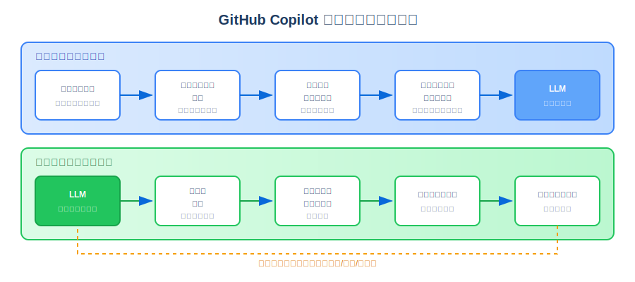
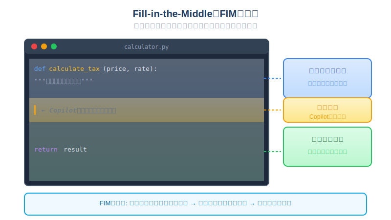
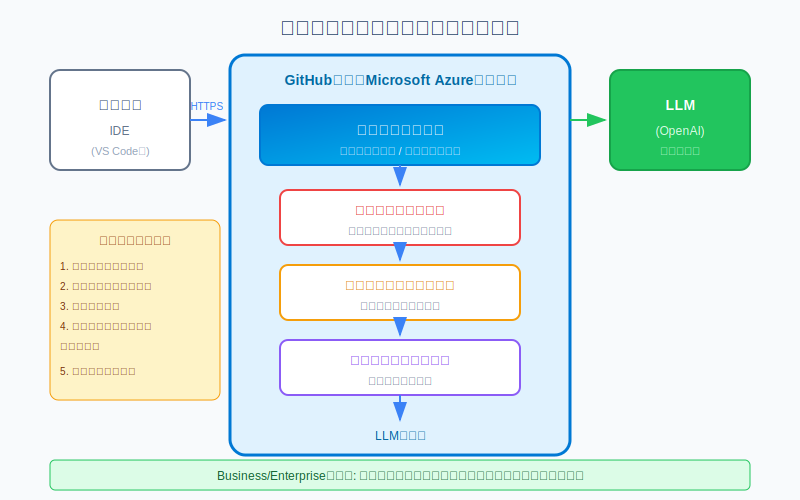
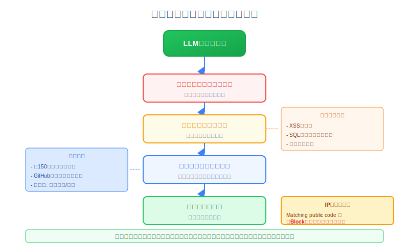

<!-- _class: title -->
<!-- _paginate: false -->

# GitHub Copilotのしくみとデータ処理

---

# このセクションで学ぶこと

- データパイプラインの全体像（インバウンド/アウトバウンドフロー）
- コンテキスト収集とFill-in-the-Middle（FIM）手法
- プロキシサービスとフィルター処理の仕組み
- 大規模言語モデル（LLM）の役割とファインチューニング
- 一致コード識別とIP補償（知的財産保護）
- プラン別のデータ処理とプライバシー設定
- LLMの制限と効果的な活用方法

---

<!-- _class: lecture -->
<!-- _paginate: false -->

# コード提案のデータパイプラインライフサイクル

---

# データパイプラインの全体像

GitHub Copilotがコード提案を生成するまでには、2つのフローがあります

## インバウンドフロー（入力処理）
ユーザーの入力をLLMに安全に届ける処理

## アウトバウンドフロー（出力処理）
LLMからの応答を検証してユーザーに届ける処理

<span class="red">試験ポイント: 2つのフローの役割を理解しておこう</span>

---



---

# 7つの処理ステップ

| ステップ | フロー | 処理内容 |
|:-------:|:------:|----------|
| 1 | インバウンド | 安全なプロンプト送信とコンテキスト収集 |
| 2 | インバウンド | プロキシフィルター（不正操作の防止） |
| 3 | インバウンド | トキシシティフィルタリング（有害コンテンツ除外） |
| 4 | インバウンド | LLMによるコード生成 |
| 5 | アウトバウンド | 後処理とレスポンス検証 |
| 6 | アウトバウンド | 提案のデリバリーとフィードバックループ開始 |
| 7 | アウトバウンド | 後続プロンプトに対するプロセスの繰り返し |

---

# インバウンドフローとアウトバウンドフロー

## インバウンドフローの役割
- HTTPSによる暗号化通信
- 周囲のコードからコンテキストを構築
- 悪意あるプロンプトのフィルタリング
- 整形されたプロンプトをLLMに送信

## アウトバウンドフローの役割
- コードの品質チェック（脆弱性・バグ）
- パブリックコードとの照合
- 不適切なコンテンツの除外
- ユーザーの操作から学習（フィードバック）

---

<!-- _class: lecture -->
<!-- _paginate: false -->

# コンテキスト収集とプロンプト構築の仕組み

---

# 安全なプロンプト送信

GitHub Copilotへの通信は以下のセキュリティ対策が施されています

| セキュリティ対策 | 説明 |
|----------------|------|
| **HTTPS通信** | すべてのプロンプトは暗号化されて送信 |
| **機密性の保護** | 送信されたコードやコメントは安全に保護 |
| **認証** | GitHubアカウントによる認証が必要 |

---

# コンテキスト収集の詳細

GitHub Copilotは以下の情報を収集してプロンプトを構築します

| 収集する情報 | 説明 |
|-------------|------|
| **カーソル前のコード** | 現在編集中の行より前のコード（プレフィックス） |
| **カーソル後のコード** | 現在編集中の行より後のコード（サフィックス） |
| **ファイル名とタイプ** | 編集中のファイルの名前と拡張子 |
| **隣接する開いているタブ** | 同じプロジェクト内で開いている他のファイル |
| **プロジェクト構造** | ファイルパスやディレクトリ構造 |
| **プログラミング言語** | 使用されている言語とフレームワーク |

---



---

# FIM手法のポイント

## FIMとは？
カーソルの**前後両方**のコンテキストを使用してコードを生成する手法

## FIMの3つの利点

1. **カーソルの前後両方**のコンテキストを使用
2. 既存のコード構造に**適合する**提案が可能
3. より**正確で関連性の高い**コード生成

<span class="red">ポイント: FIMはプレフィックス（前）とサフィックス（後）の両方を使用</span>

---

# コンテキストの優先順位

Copilotは以下の優先順位でコンテキストを処理します

| 優先順位 | 情報源 | 説明 |
|:-------:|--------|------|
| 1 | **現在のファイル** | 最も重要なコンテキスト |
| 2 | **開いているタブ** | 関連性の高いファイル |
| 3 | **プロジェクト構造** | ファイルパスやディレクトリ名 |
| 4 | **言語とフレームワーク** | 構文やライブラリの推測 |

## ヒント
より良い提案を得るには、関連するファイルをタブで開いておくと効果的

---

<!-- _class: lecture -->
<!-- _paginate: false -->

# プロキシサービスとフィルター処理

---



---

# プロキシサーバーの機能

GitHub Copilotのプロキシサーバーは**GitHubが所有するMicrosoft Azureテナント**でホスト

| 機能 | 説明 |
|------|------|
| **トラフィックフィルタリング** | 不正なプロンプト操作の試みをブロック |
| **プロンプトハッキング防止** | モデルの内部動作を暴露させる攻撃を防止 |
| **リクエスト転送** | フィルタリング後のプロンプトをLLMに転送 |
| **レスポンス検証** | LLMからの応答を検証して返送 |

---

# フィルタリング

コード生成の前に、以下の有害コンテンツを除外します

### 1. ヘイトスピーチと不適切なコンテンツの検出
- 攻撃的な言語やヘイトスピーチを検出
- 不適切または有害なコンテンツを除外
- アルゴリズムによる自動検出

### 2. 個人データの保護
- 名前、住所、識別番号などの個人情報をフィルタリング
- ユーザーのプライバシーとデータセキュリティを保護
- 機密情報の漏洩を防止

---

<!-- _class: lecture -->
<!-- _paginate: false -->

# 大規模言語モデル（LLM）のレスポンス生成

---

# GitHub CopilotでのLLMの処理フロー

## LLMによるコード生成の4ステップ

1. **プロンプト受信** → 入力トークンに分割
2. **コンテキスト分析** → 周囲のコードパターンを理解
3. **コード生成** → 最も確率の高い次のトークンを予測
4. **出力生成** → 完全なコード提案を構築

## LLMが考慮する要素
- 現在のファイルのコード
- 開いている他のファイルやタブ
- プロジェクト全体の構造
- プログラミング言語の構文

---

# ファインチューニングとは

事前トレーニング済みのLLMを特定のタスクに適応させるプロセス

## プロセス
```
ソースモデル → ターゲットデータセット → ファインチューンされたモデル
(大規模な事前     (タスク固有)           (特化型)
 トレーニング済)
```

## ファインチューニングの目的
- 汎用的なLLMをコード生成に特化
- 特定のプログラミング言語やフレームワークへの対応を強化

---

# LoRA（Low-Rank Adaptation）ファインチューニング

GitHubは効率的なファインチューニング手法である**LoRA**を使用

| 比較項目 | 従来のファインチューニング | LoRA |
|---------|-------------------------|------|
| トレーニング対象 | 全パラメータ | 追加パラメータのみ |
| リソース消費 | 高い | 低い |
| 処理時間 | 長い | 短い |
| 性能 | 良好 | 同等以上 |

---

<!-- _class: lecture -->
<!-- _paginate: false -->

# 一致コード識別と後処理

---



---

# コード品質チェック

提案されるコードは、以下のセキュリティチェックが行われます

| チェック項目 | 説明 |
|-------------|------|
| **XSS（クロスサイトスクリプティング）** | Webアプリケーションの脆弱性検出 |
| **SQLインジェクション** | データベース攻撃の脆弱性検出 |
| **一般的なバグ** | よくあるプログラミングエラーの検出 |
| **セキュリティベストプラクティス** | セキュアコーディング規約の確認 |

---

# パブリックコードのフィルタリング

管理者は**パブリックコードと一致する提案のブロック機能**を有効にできます

### フィルターの動作
- 約**150文字以上**の提案が対象
- GitHubの既存パブリックコードと照合
- 一致が検出された場合、提案は切り詰めまたは破棄

### 設定方法
2. **Your enterprises**または**Your organizations**を選択
3. **Settings** → **Copilot**に移動
4. **Suggestions**で**Matching public code**を**Block**に設定

---

# 契約上の保護（IP補償）

GitHub Copilot BusinessおよびEnterpriseプランでは**知的財産（IP）補償**が提供

| 保護の種類 | 説明 |
|-----------|------|
| **IP補償** | Copilotの提案が第三者のIP権を侵害していると訴えられた場合、GitHubが法的責任を負う |
| **データ保護契約（DPA）** | データ保護とプライバシー規制への準拠を保証 |
| **GitHub Copilot Trust Center** | セキュリティ、プライバシー、コンプライアンス情報を提供 |

<span class="red">ポイント: IP補償を受けるにはMatching public codeを「Block」に設定する必要がある</span>

---

<!-- _class: lecture -->
<!-- _paginate: false -->

# データフロー（Individual/Chat/コード補完）

---

# コード補完のデータ処理

GitHub Copilotのコード補完機能では、**プロンプトや提案は保持されません**

## データフロー
1. ユーザーがコードを入力
2. コンテキストとプロンプトがLLMに送信
3. LLMがコード提案を生成
4. 提案がユーザーに表示
5. プロンプトと提案は**破棄**

<span class="red">試験ポイント: コード補完ではプロンプトは保持されない</span>

---

# Copilot Chatのデータ処理

Copilot Chatは、コード補完とは異なるデータ処理を行います

| 項目 | コード補完 | Copilot Chat |
|------|-----------|--------------|
| データ保持 | なし | 最大28日間 |
| 会話履歴 | なし | 維持される |
| コンテキスト理解 | 現在のファイルのみ | 会話全体 |
| ユースケース | リアルタイムコード提案 | 対話的なコーディング支援 |

---

# Copilot Chatがサポートするプロンプトタイプ

| プロンプトタイプ | 例 |
|-----------------|-----|
| **直接的な質問** | 「Pythonでクイックソートを実装するには？」 |
| **コード関連のリクエスト** | 「階乗を計算する関数を書いて」 |
| **オープンエンドなクエリ** | 「クリーンコードのベストプラクティスは？」 |
| **コンテキストプロンプト** | 「このコードを改善できる？」 |

---

# プラン別のデータ処理比較

| 機能 | Individual | Business | Enterprise |
|------|-----------|----------|------------|
| プロンプト保持 | オプトアウト可能 | 保持なし | 保持なし |
| モデルトレーニングへの使用 | オプトアウト可能 | なし | なし |
| IP補償 | なし | あり | あり |
| 組織管理 | なし | あり | あり |

<span class="red">ポイント: Business/Enterpriseではコードはトレーニングに使用されない</span>

---

# Individual契約者のオプトアウト設定

GitHub Copilot Individualユーザーは、プロンプト共有をオプトアウトできます

## 設定手順
1. GitHubの**Settings**に移動
2. **Copilot**セクションを選択
3. **Allow GitHub to use my code snippets from the code editor for product improvements**のチェックを外す

## Business/Enterpriseプラン
- ユーザーのコードはモデルのトレーニングに使用されない
- プロンプトも保持されない

---

<!-- _class: lecture -->
<!-- _paginate: false -->

# LLMの制限（コンテキストウィンドウ・データの古さ）

---

# コンテキストウィンドウの制限

LLMには一度に処理できる情報量に**制限**があります

| 機能 | コンテキストウィンドウ |
|------|---------------------|
| **コード補完** | 約200〜500行 / 数千トークン |
| **Copilot Chat** | 数千~数万トークン ※モデルによる |

## トークンとは？
- テキストの単位（単語、サブワード、文字など）
- 英語では1単語 ≒ 1〜2トークン
- コードでは記号や括弧も1トークンとしてカウント

---

# トレーニングデータの古さ

LLMは過去のデータでトレーニングされているため、**最新の情報を知らない**可能性があります

| 制限 | 影響 |
|------|------|
| **カットオフ日** | トレーニングデータには終了日がある |
| **新しいライブラリ** | 最新のAPIやライブラリを知らない可能性 |
| **フレームワーク更新** | 最新の構文やベストプラクティスに対応していない可能性 |
| **新しい言語機能** | 言語の最新機能を提案できない可能性 |

---

# 非決定論的な出力

LLMの出力には**同じ入力でも異なる結果**が返される可能性があります

```
同じ入力 → 異なる出力の可能性

出力A: function add(a, b) { return a + b; }
出力B: const add = (a, b) => a + b;
出力C: function sum(a, b) { return a + b; }
```

## 非決定論的出力の特徴
- 確率的なトークン選択に基づく
- 許容範囲の出力であれば問題にならないことが多い

---

# LLMの制限に関する重要な考慮事項

| 考慮事項 | 説明 |
|---------|------|
| **1. 非決定論的** | 同じ入力で異なる出力が得られる可能性 |
| **2. 品質のばらつき** | 低品質または不正確な出力が生成される可能性 |
| **3. コンテキストの制限** | ユーザーの意図を完全に理解できない |
| **4. トレーニングデータの制限** | 最新の機能やパターンに対応していない可能性 |

<span class="red">試験ポイント: LLMには非決定論的出力やコンテキスト制限がある</span>

---

# 効果的な活用のためのヒント

## 1. 複雑な問題を分割する
- 悪い例: 「eコマースサイト全体のバックエンドを作って」
- 良い例: 「ユーザー認証のためのログイン関数を作って」

## 2. 関連するコードスニペットを提供する
- 既存のクラスやメソッドを参照して新しいコードを追加

## 3. コンテキストウィンドウを意識する
- 大きなファイルよりも**関連する部分**を開く
- 必要な情報を**集中的に**提供
- 不要なタブは閉じて**ノイズを減らす**

---

# まとめ

## データパイプライン
- インバウンドフロー（入力）とアウトバウンドフロー（出力）の7ステップ

## コンテキスト収集
- FIM手法でカーソル前後のコンテキストを活用

## フィルタリングと後処理
- プロキシサービスがMicrosoft Azureテナントでホスト
- パブリックコード照合とIP補償

## データ処理の違い
- コード補完: データ保持なし / Copilot Chat: 28日間保持
- Business/Enterprise: コードはトレーニングに使用されない

---

# 試験対策ポイント

1. **FIM手法**: プレフィックスとサフィックスの両方を使用
2. **プロキシサーバー**: GitHub所有のMicrosoft Azureテナントでホスト
3. **パブリックコード照合**: 約150文字以上の提案が対象
4. **IP補償の条件**: Matching public codeを「Block」に設定
5. **データ保持期間**: コード補完は保持なし、Chatは28日間
6. **コンテキストウィンドウ**: コード補完は200〜500行、Chatは4,000トークン
7. **Business/Enterprise**: ユーザーコードはトレーニングに使用されない
8. **LoRA**: 効率的なファインチューニング手法
