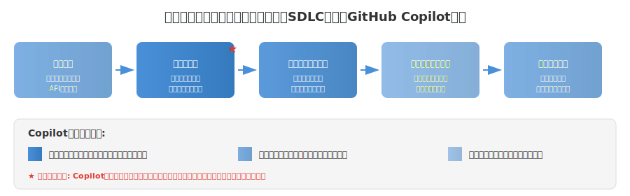

<!-- _class: title -->
<!-- _paginate: false -->

# AIの開発者ユースケース

---

# このセクションで学ぶこと

## 学習目標

- GitHub Copilotが開発ワークフローを効率化する7つの領域を理解する
- ソフトウェア開発ライフサイクル（SDLC）でのCopilot活用方法を把握する
- PRU（Premium Request Units）と制限事項を理解する
- 使用状況メトリックの測定方法を学ぶ

<span class="red">試験ポイント: このセクションは試験全体の14%を占める重要分野です</span>

---

<!-- _class: lecture -->
<!-- _paginate: false -->

# 開発者の生産性向上ユースケース概要

---

# GitHub Copilotによる生産性向上の7つの領域

| 領域 | 主な効果 |
|------|----------|
| 新しい言語・フレームワークの習得 | 学習と実践のギャップを埋める |
| コンテキスト切り替えの最小化 | ワークフロー中断の防止、集中力維持 |
| ドキュメント記述の改善 | コードの保守性向上 |
| 退屈な作業の自動化 | 創造的な作業への時間確保 |
| PRワークフローの高速化 | 開発からデプロイまでの時間短縮 |
| 調整されたAIワークフロー | マルチエージェントによる包括的支援 |
| コード補完のカスタマイズ | 個人のスタイルへの適応 |

---

# 生産性向上の具体的効果

GitHub Copilotを活用することで、開発者は以下を実現できます：

- **定型的なタスクの時間を大幅に短縮**
- **新しいテクノロジーをより短い時間で習得**
- **作業中の集中力をいっそう高く維持**
- **複雑な問題の解決とプロジェクト内での革新に専念する時間を確保**

<span class="red">試験ポイント: Copilotは「コード生成」だけでなく「生産性向上」のツールとして理解する</span>

---

<!-- _class: lecture -->
<!-- _paginate: false -->

# 新しい言語・フレームワークの学習支援

---

# GitHub Copilotの学習支援機能

| 機能 | 説明 |
|------|------|
| **コードの提案** | 馴染みのない関数やライブラリの使い方がわかるコードスニペットを提供 |
| **言語のサポート** | さまざまな言語をサポートし、ある言語から別の言語へのスムーズな移行を支援 |
| **ドキュメントの統合** | APIの使い方と関数のパラメーターに関連する提案を提供 |

<span class="red">ポイント: 外部ドキュメント参照を削減し、IDE内で学習を完結できる</span>

---

# ハンズオン: 「これを説明する」機能の活用

**シナリオ**: 馴染みのない言語（Golang）でプロジェクトの作業を行う

**手順**:
1. GitHub Copilotを使ってコードを自動生成する
2. 生成されたコードを選択する
3. コンテキストメニューの「**これを説明する（Explain This）**」オプションを使用
4. コードで行われていることを理解する

**期待される効果**:
- 新しい言語の構文やパターンを実践を通じて学習
- ドキュメントを調べる時間の削減

---

<!-- _class: lecture -->
<!-- _paginate: false -->

# コードのデバッグとリファクタリング

---

# コンテキスト切り替えの最小化

コンテキストの切り替えは、開発者にとって**生産性を大幅に低下させる**ものです。

| 機能 | 効果 |
|------|------|
| **エディター内のアシスタンス** | IDE内で直接コード提案を提供し、オンライン検索の必要性を最小化 |
| **クイックリファレンス** | APIやライブラリ使用時に正しいメソッドの呼び出しとパラメーターを提案 |
| **コード補完** | 繰り返されるコードパターンをオートコンプリートし、思考の流れを維持 |

---

# コードの変換とリファクタリング

GitHub Copilotは以下の方法でコードのリファクタリングを支援します：

- **改善されたパターンの提案**: より効率的な実装方法の提示
- **プログラミング言語の変換**: 異なる言語間でのコード変換
- **コード品質の向上**: ベストプラクティスに基づいた改善提案

## ハンズオン: `/optimize` コマンドの使用

1. リファクタリングしたいコードを選択
2. インラインチャット（`Ctrl+I` / `Cmd+I`）を開く
3. `/optimize` コマンドでコードの最適化を依頼
4. 提案された改善を確認し、適用

---

<!-- _class: lecture -->
<!-- _paginate: false -->

# ドキュメント作成とコメント生成

---

# ドキュメント記述の改善機能

| 機能 | 説明 |
|------|------|
| **インラインコメント** | 複雑なコードセクションを説明するコンテキストに関連したコメントを生成 |
| **関数の説明** | パラメーターの説明や戻り値の詳細など、関数の説明を自動的に提案 |
| **README の生成** | プロジェクトのコードベースに基づいて構造と内容を提案 |
| **ドキュメントの整合性** | プロジェクト全体で一貫したドキュメントスタイルを維持 |

<span class="red">ポイント: `/doc` コマンドでドキュメント生成ができる</span>

---

# ハンズオン: ドキュメント自動生成

**シナリオ**: 関数にドキュメントコメントを追加する

**手順**:
1. ドキュメント化したい関数を選択
2. インラインチャットで `/doc` コマンドを実行
3. 生成されたドキュメントを確認・調整
4. 必要に応じてパラメーター説明を補足

**期待される効果**:
- コードの統一されたドキュメントスタイル
- 関数やコード全体に関連するコメントの効率的な作成

---

<!-- _class: lecture -->
<!-- _paginate: false -->

# サンプルデータ生成とレガシーコードの近代化

---

# 退屈な作業の自動化

GitHub Copilotは定型的なコーディングタスクの処理に優れています。

| 自動化タスク | 説明 |
|-------------|------|
| **定型コードの生成** | REST APIの設定やクラス構造の作成など |
| **サンプルデータの作成** | テスト用の現実的なサンプルデータを生成 |
| **単体テストの作成** | テストケースの提案や単体テスト全体の生成 |
| **コードの変換とリファクタリング** | 改善されたパターンや言語変換を含む支援 |

<span class="red">ポイント: 本番環境の運用タスク（バックアップなど）は行わない</span>

---

# 高度な定型自動化シナリオ

| シナリオ | 詳細 |
|---------|------|
| **データベーススキーマとORMのセットアップ** | エンティティの説明に基づいて、完全なデータベースモデル、移行ファイル、ORM構成を生成 |
| **APIエンドポイントスキャフォールディング** | エラー処理、検証、ドキュメントコメントを含むREST APIエンドポイント全体を作成 |
| **構成管理** | 開発、ステージング、本番環境の構成ファイルを生成 |
| **テストインフラストラクチャ** | モックデータ、フィクスチャ、ヘルパー関数を含む完全なテストフレームワークを設定 |

---

# ストーリー駆動型の開発自動化

GitHub Copilotは、ユーザーストーリーを完全な実装に直接変換できます。

**主な機能**:
- **コード骨格の自動生成（機能スキャフォールディング）**: 機能の説明を完全なコード構造に変換
- **ビジネスロジックの実装**: ビジネスルールに基づいてコア機能を生成
- **統合パターン**: 認証、ログ記録、外部サービス統合のパターンを作成
- **エンドツーエンドの自動化**: 単一のユーザーストーリーから完全な機能スタックを生成
- **品質の組み込み**: エラー処理、入力検証、ログ記録、セキュリティを自動的に含める

---

<!-- _class: lecture -->
<!-- _paginate: false -->

# SDLCにおけるCopilotの活用

---


---

# 要件分析フェーズ

<span class="red">注意: Copilotは要求を知らないため、指示する必要があります</span>

| 機能 | 説明 |
|------|------|
| **迅速なプロトタイプ作成** | 概要説明に基づいてコードスニペットを迅速に生成し、概念実証開発を可能にする |
| **ユーザーストーリーの実装** | ユーザーストーリーを初期の関数またはクラス定義に変換 |
| **API設計** | 説明された機能に基づいてAPI構造を提案 |

<span class="red">注意: 顧客ヒアリングや予算見積もりは行わない</span>

---

# 設計と開発フェーズ

<span class="red">GitHub Copilotが真価を発揮するフェーズです</span>

| 機能 | 効果 |
|------|------|
| **定型コードの生成** | 反復的なコード構造を自動的に作成 |
| **設計パターンの実装** | 問題の状況に基づいて適切な設計パターンを提案 |
| **コードの最適化** | より効率的なコードの代替案を提示 |
| **クロス言語翻訳** | 異なるプログラミング言語間での翻訳を支援 |

---

# テストと品質保証フェーズ

| 機能 | 説明 |
|------|------|
| **単体テストの作成** | 関数のシグネチャと動作に基づいてテストケースを生成 |
| **テストデータの生成** | 現実的なテストデータセットを作成 |
| **エッジケースの識別** | エッジケースをカバーするテストシナリオを提案 |
| **アサーションの提案** | 予想される動作に基づいて適切なアサーションを提案 |

<span class="red">注意: 本番環境でのテスト自動実行や監視は行わない</span>

---

# 自動化されたテストワークフロー

| 機能 | 説明 |
|------|------|
| **テストスイートのアーキテクチャ** | 単体・統合・E2Eテストを含む完全なテストフレームワークを設計 |
| **自動化パイプラインをテストする** | CI/CD統合のテスト構成ファイルを生成 |
| **品質ゲート** | 開発パイプラインを進める前の自動品質チェックを作成 |
| **パフォーマンステスト** | パフォーマンスベンチマークとロードテストシナリオを生成 |

品質保証が開発プロセスの**統合された部分**になります。

---

# 展開（デプロイ）フェーズ

<span class="red">注意: Copilotはデプロイプロセスには直接関与しません</span>

| 機能 | 説明 |
|------|------|
| **構成ファイルの生成** | さまざまな環境向けのデプロイ構成ファイルの作成を支援 |
| **デプロイスクリプトの支援** | 一般的なデプロイタスク用のコマンドまたはスクリプトを提案 |
| **ドキュメントの更新** | デプロイドキュメントを更新し、最近の変更を反映 |

---

# メンテナンスとサポートフェーズ

<span class="red">注意: カスタマーサポートチケットへの自動応答は行わない</span>

| 機能 | 説明 |
|------|------|
| **バグ修正の提案** | エラーメッセージと周辺のコードに基づいて修正プログラムを提案 |
| **コードのリファクタリング** | 既存のコードの改善を提案 |
| **ドキュメントの更新** | コードのコメントとドキュメントを変更と同期 |
| **レガシコードの理解** | 説明と最新の同等のコードを提供 |

---

<!-- _class: lecture -->
<!-- _paginate: false -->

# PRワークフローの高速化

---

# PR対応コードの生成

GitHub Copilotは、レビュー対応の変更を生成し、開発からデプロイまでの時間を短縮します。

| 機能 | 効果 |
|------|------|
| **完全な実装** | エラー処理、ログ記録、エッジケースカバレッジを含む完全な機能実装を生成 |
| **一貫性のあるコードパターン** | プロジェクト規則とアーキテクチャパターンに従った新しいコードを確保 |
| **ドキュメントの統合** | インラインコメント、関数ドキュメント、README更新を含める |
| **テスト対象範囲** | 対応する単体テスト、統合テスト、使用例を生成 |

---

# インテリジェントなコードレビュー支援

- **提出前の品質チェック**: PR作成前に潜在的な問題を特定し改善を提案
- **コメントの下書きを確認**: 建設的で具体的なレビューコメントを生成
- **迅速なイテレーション**: 変更要求に対して複数の実装代替案をすぐに生成
- **競合の解決**: 両方のコードブランチの意図を理解し、最適な統合アプローチを提案
- **ドキュメントの絞り込み**: レビュー担当者のフィードバックに基づいてドキュメントを改善

<span class="red">試験ポイント: PRの自動マージやレビュー担当者の自動割り当ては行わない</span>

---

# コラボレーション開発ワークフロー

- **コードの標準化**: チームメンバー間で一貫したコーディングスタイルとパターンを維持
- **ナレッジ共有**: ジュニア開発者がシニアパターンから学習できるよう支援
- **コンテキストの保持**: 他のユーザーの作業を引き継ぐ場合、既存のコードを理解し同じスタイルで開発を継続

---

# 包括的な機能配信ワークフロー

| フェーズ | 説明 |
|---------|------|
| **1. 分析フェーズ** | ユーザーストーリーと技術要件を解析して実装計画を作成 |
| **2. 実装フェーズ** | 必要なすべてのコンポーネントを含む完全な機能コードを生成 |
| **3. 品質保証フェーズ** | 包括的なテストスイートと品質チェックを作成 |
| **4. ドキュメントフェーズ** | ユーザードキュメント、APIドキュメント、メンテナンスガイドを生成 |
| **5. デプロイフェーズ** | デプロイスクリプトと監視構成を作成 |

<span class="red">試験ポイント: この順序が正しいフェーズ順序（分析→実装→品質保証→ドキュメント→デプロイ）</span>

---

<!-- _class: lecture -->
<!-- _paginate: false -->

# 生産性APIの使用方法

---

# コード補完のカスタマイズ

GitHub Copilotは、個別のコーディングスタイルとプロジェクトコンテキストに適応します。

| 機能 | 説明 |
|------|------|
| **コンテキストの理解** | 開発環境とプロジェクトの構造を分析し、より正確で関連性の高いコード補完を提供 |
| **パターンからの学習** | 開発者がプロジェクトで作業している間、そのコーディングパターンと好みを学習 |

**時間が経つほど提案の関連性が高くなります**

---

# 適応型コード提案の仕組み

GitHub Copilotの提案は以下の要因に基づいて改善されます：

1. **プロジェクト構造**: ファイル配置やモジュール構成を考慮
2. **コーディングスタイル**: 既存のコードのスタイルに合わせた提案
3. **使用パターン**: 繰り返し使用されるパターンの認識と適用
4. **命名規則**: プロジェクト内の命名規則に従った変数名・関数名の提案

**例**: アロー関数 vs 通常の関数宣言、async/await vs Promiseチェーン

---

# GitHub Copilot使用状況メトリックのREST API

使用状況を測定・分析するための**REST API**が提供されています。

## エンタープライズメンバーの使用状況取得

**エンドポイント**: `GET /enterprises/{enterprise}/copilot/usage`

```bash
curl -L \
  -H "Accept: application/vnd.github+json" \
  -H "Authorization: Bearer <YOUR-TOKEN>" \
  https://api.github.com/enterprises/ENTERPRISE/copilot/usage
```

<span class="red">試験ポイント: このエンドポイントを覚えておく</span>

---

# その他の使用状況取得エンドポイント

| エンドポイント | 説明 |
|--------------|------|
| `GET /enterprises/{enterprise}/copilot/usage` | エンタープライズ全体の使用状況 |
| `GET /enterprises/{enterprise}/team/{team_slug}/copilot/usage` | 特定のエンタープライズチーム |
| `GET /orgs/{org}/copilot/usage` | 組織全体の使用状況 |

**レスポンス内容**: 提案、受け入れ、アクティブユーザー、エディターと言語別の内訳など

---

# 測定フレームワークの実装

GitHub Copilotの影響を体系的に評価するための**4段階フレームワーク**

| フェーズ | 説明 | 主要メトリック |
|---------|------|---------------|
| **1. 評価** | 導入の最初のフェーズ | 開発者の満足度、タスク完了率、日次アクティブユーザー数 |
| **2. 導入** | チームのワークフローへの統合 | 生産性メトリック、有効化インジケーター |
| **3. 最適化** | 完全導入後の微調整 | 市場投入までの時間、コード品質向上 |
| **4. 持続的な効率性** | 継続的な評価と調整 | 長期的な生産性向上 |

---

# GitHub Copilot開発者アンケート

| 形式 | 頻度 | 目的 |
|------|------|------|
| **短い形式** | 2週間ごと | 頻繁なフィードバック収集。全体的な満足度、直面した課題 |
| **長い形式** | 4週間に1回以内 | 包括的なフィードバック。詳細な使用状況分析 |

**プライバシーに関する考慮事項**:
- 回答は匿名化し、個人開発者にさかのぼれないようにする
- 個人の回答を業績評価に使用しない

<span class="red">試験ポイント: 短い形式は2週間ごと、長い形式は4週間に1回以内</span>

---

<!-- _class: lecture -->
<!-- _paginate: false -->

# Copilot活用の制限と注意点

---

# GitHub Copilotの制限事項: コードの品質と正確性

| 制限事項 | 説明 |
|---------|------|
| **エラーの可能性** | バグを含むコードや要件を完全に満たしていないコードを提案することがある |
| **セキュリティに関する懸念事項** | 常にベストセキュリティプラクティスに準拠するとは限らない |
| **コンテキストの解釈の誤り** | より広範なコンテキストを誤解し、不適切な提案につながる可能性がある |

<span class="red">ポイント: 生成されたコードはバグがないことを保証されない - レビュー必須</span>

---

# GitHub Copilotの制限事項: 言語とトレーニングデータ

### 言語とフレームワークの特定性

| 制限事項 | 説明 |
|---------|------|
| **パフォーマンス** | 言語やフレームワークによって有効性が異なる |
| **ニッチ技術** | あまり一般的ではないテクノロジの場合、正確性が低いことがある |

### トレーニングデータへの依存

| 制限事項 | 説明 |
|---------|------|
| **提案のバイアス** | トレーニングデータのパターンを反映し、バイアスや古いプラクティスが含まれる可能性 |
| **著作権に関する懸念事項** | 生成されたコードの著作権への影響については議論が続けられている |

<span class="red">注意: トレーニングデータは常に最新の状態に自動更新されるわけではない</span>

---

# GitHub Copilotの制限事項: 複雑な問題解決

| 制限事項 | 説明 |
|---------|------|
| **高度な設計における制限事項** | コードレベルのタスクに優れているが、複雑なアーキテクチャ上の決定を把握できない場合がある |
| **創造性の制約** | 新しい問題を解決する際の人間の創造性に取って代わることはできない |

<span class="red">注意: Copilotは人間の創造性を完全に代替できない</span>

---

# 効率的なCopilot活用のベストプラクティス

1. **タスクの複雑さに応じたモデル選択**
   - 日常的なタスクには標準モデル
   - 複雑な分析にはプレミアムモデル

2. **PRU使用量の監視**
   - 毎月の許容量を意識した使用

3. **コンテキストの最適化**
   - 必要な情報のみを提供してPRU効率を最大化

4. **反復的なアプローチ**
   - 大きなタスクを小さなステップに分割

---

# まとめ

GitHub Copilotを効果的に活用することで、開発者は：

- **定型的なタスクに費やす時間を大幅に短縮**
- **新しいテクノロジーをより短い時間で習得**
- **作業中の集中力をいっそう高く維持**
- **複雑な問題の解決とプロジェクト内での革新に専念する時間を確保**

<span class="red">重要: Copilotは強力なツールだが、人間のレビューと判断は必須</span>

---

# 試験対策ポイント

## よく出る問題パターン

| パターン | ポイント |
|---------|---------|
| Copilotが**できる**こと | コード生成、ドキュメント作成、テスト生成、リファクタリング支援 |
| Copilotが**できない**こと | 自動デプロイ、本番バックアップ、カスタマーサポート対応、要件収集 |
| PRU消費量 | 標準1PRU、プレミアム2PRU、@workspace 2-5PRU |

---

# 試験対策ポイント（続き）

## よくある誤答

- ❌ Copilotは本番環境に自動デプロイできる
- ❌ 生成されたコードはバグがないことが保証される
- ❌ Copilotは人間の創造性を完全に代替できる
- ❌ トレーニングデータは常に最新に自動更新される
- ❌ PRUはすべての操作で同じ消費量

## 正しい理解

- ✅ Copilotはコード生成に特化し、運用タスクは行わない
- ✅ 生成されたコードは人間のレビューが必須
- ✅ Copilotは開発者を支援するツールであり、代替ではない